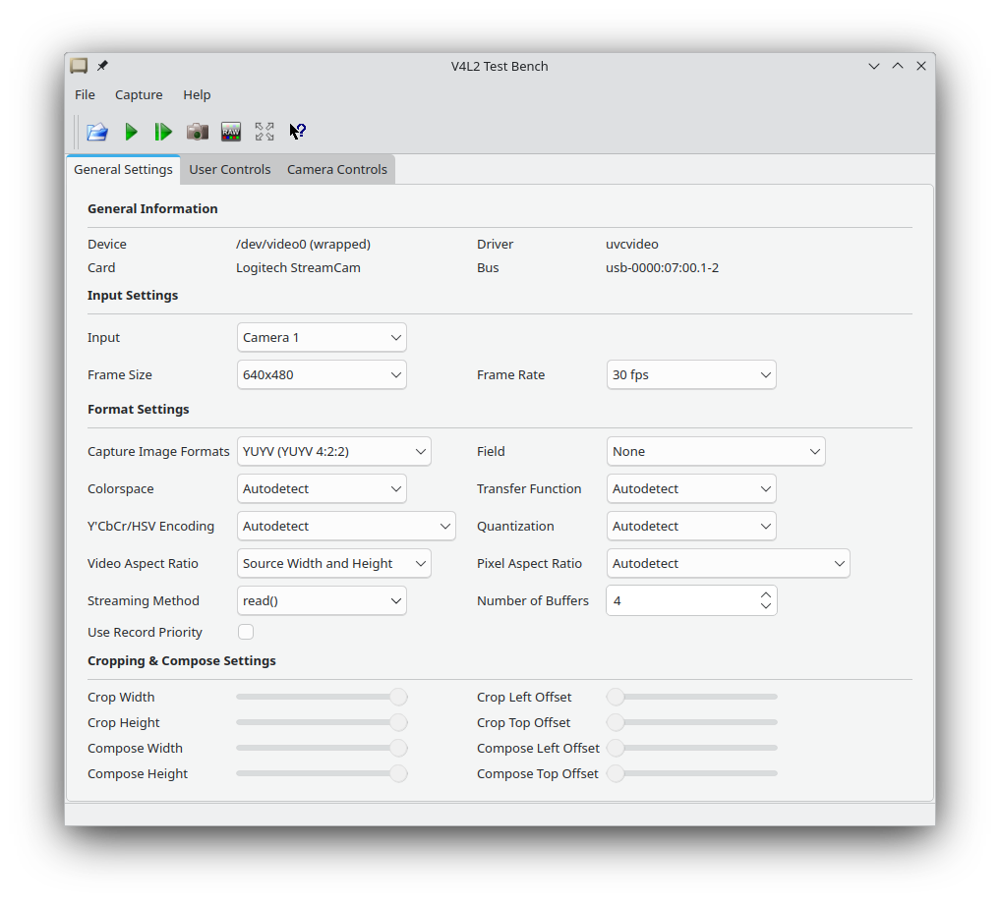
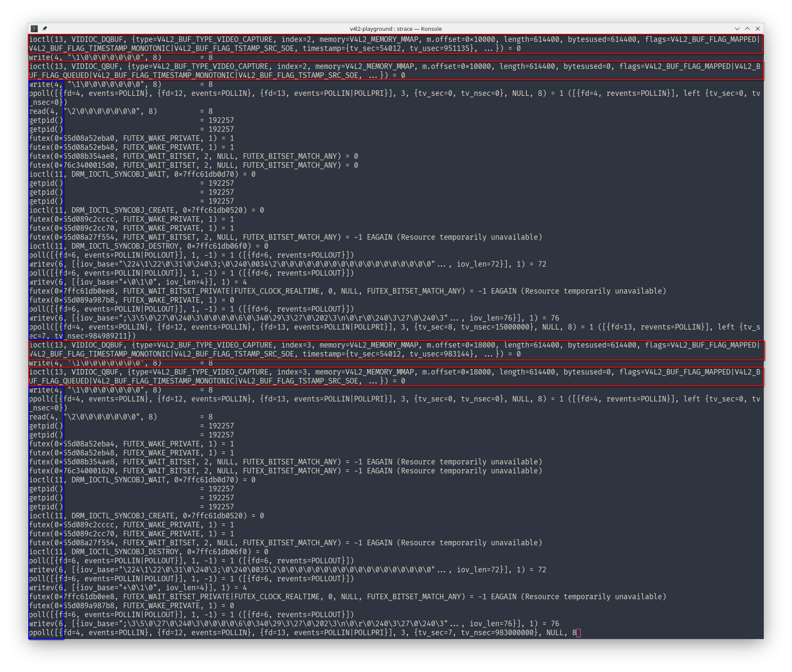
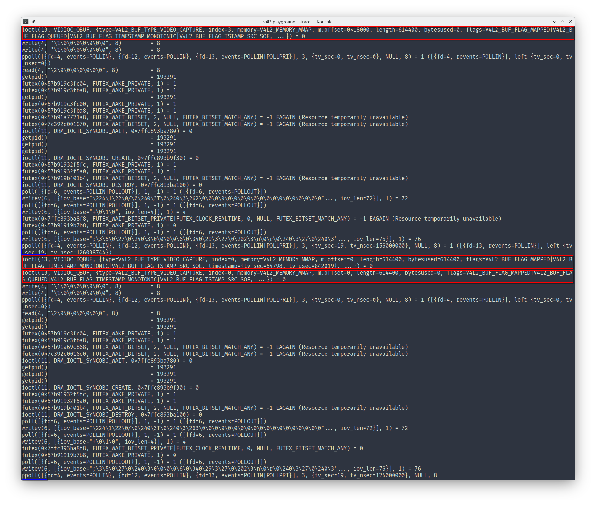

# v4l2-playground

This repository contains code to read frames from a webcam (v4l2 device) upload it to OpenGL and display it in a window. AND:

* Code used to play around with v4l2 devices.
* A C [library](frame_reader.h) to read and decode video frames
* C [functions](main.c) to interact with video devices
* **This README packed with all the things I learnd while working on this.**
   * [Video Devices](#about-video-devices)
   * [MMAP](#about-mmap)
   * [stb_image](#about-stb_image)
   * [YUV Formats](#about-yuv-formats)
* [Links](#things-to-read) to more resources
* [Build instructions](#playground)

## Next Steps

There a lot of things which could be improved in the future.

* [ ] Copy data from the CPU to the GPU more efficiently.
* [ ] Decode YUV formats in OpenGL shaders.
* [ ] Flip texture in OpenGL shader not by differently mapping it.
* [ ] Improve the `frame_reader` to be more reusable
* [ ] Add error handling (`ioctl`, `read`: `EINTR`, `EAGAIN`, ...)

## Things I Learned

### About Video Devices

Every device supports a number of
* Formats
* Resolutions
* Capture Methods

Reading the first two things was/is easy (can be queried with ioctl), reading available capturing methods was a little bit of a curve ball. I started by trying to use `read()` since it seamed to be the easiest supported by my camera as reported by `qv4l2`.



Only after discovering that every call to `read()` returned `-1`, I started to use other tools to discover my devices capabilities (`v4l2-ctl`) which did not report `Read/Write` support for my camera but only for loopback devices. This shows us where `v4l2-ctl` would display support for `read()` and that the detection works in principle. Being unsure about the state of `read()` support, I dove into the source code for `qv4l2`.

[v4l-helpers.h](https://git.linuxtv.org/v4l-utils.git/tree/utils/common/v4l-helpers.h#n415)
```c
static inline bool v4l_has_rw(const struct v4l_fd *f)
{
	return v4l_g_caps(f) & V4L2_CAP_READWRITE;
}
```

Every thing there seamed fine and it uses the same methods for detection as I'm using. This confused me even more. Someone was lying, so I went to bad (**BTW sleep is always the answer!**). With a clear head I remembered that I could figure out which program was lying to me by checking if it issues calls to `read()`. This can be done by running `strace qv4l2` and start displaying frames.

Running with the `V4L2_MEMORY_MMAP` method shows a stream of calls



In red we can see calls to `ioctl()`
```c
ioctl(13, VIDIOC_DQBUF, {type=V4L2_BUF_TYPE_VIDEO_CAPTURE, index=1, memory=V4L2_MEMORY_MMAP, m.offset=0x8000, length=614400, bytesused=614400, flags=V4L2_BUF_FLAG_MAPPED|V4L2_BUF_FLAG_TIMESTAMP_MONOTONIC|V4L2_BUF_FLAG_TSTAMP_SRC_SOE, timestamp={tv_sec=54389, tv_usec=42745}, ...}) = 0
```
The `VIDIOC_DQBUF` tag is used to dequeue a buffer from the device. This is only used by the "Memory-mapped" and "User-space" capturing methods. This is the correct behavior, since we are capturing with the `V4L2_MEMORY_MMAP` method.

Side note, relevant for later: In blue we can see that there are some calls to `read()` while capturing but they re only reading 8 bytes.

Running with the `read()` method shows this stream of calls



In red we can see that same calls to `ioctl`, which is already strange. The absence of additional `read()` calls in blue is a clear sign that `qv4l2` is not using the capture method it is reporting.

Puzzle solved. The answer is `qv4l2` is lying. Which in turn also means that my c implementation (using `read()`) is correctly failing. Is this a bug? Yes, probably. Am I going to report it? Maybe, probably not tho... To submit a report I would like to make sure that I can also supply a potential patch, but I haven't even tried to compile `qv4l2`. So we will see.


### About MMAP

Reading frames from a device using MMAP is a little more involved compared to `read`. The typical life cycle looks like this

1. Switch the device driver into mmap mode and how many buffers to allocate  (`>1`).
1. Allocate space for the buffers.
1. Map the buffers using `mmap`.
1. Hand the buffers over to the device (queue).
1. Tell the devices to start streaming.
1. \[Loop\] 
	1. Grab a buffer from the device (dequeue).
	1. Do something with the data.
	1. Put the buffer back into the device's queue (queue).
1. Tell the device to stop streaming. *As I [understand it](https://www.kernel.org/doc/html/v4.9/media/uapi/v4l/vidioc-reqbufs.html#description) this also implicitly tells the driver to free all buffers.*
1. Unmap the buffers (`munmap`).

The number of buffers can make a visible difference in latency. Allocating more then necessary is just a bad idea. Two should be enough, one to read from and one to let the device write to.

### About stb_image

stb_image's jpeg decoder has a very powerful SIMD implementation! It can be enabled by simply telling gcc to compile with `-msse3`. Speaking about performance, in some cases when compiling with `-Ofast` gcc complains about *undefined reference to 'pow'*. This seams to be a bug in gcc, [read more](https://stackoverflow.com/questions/62334452/fast-math-cause-undefined-reference-to-pow-finite). TLDR add `-fno-finite-math-only` to the compile command.

There might be more performance to gain if we could use only open buffer and reuse it instead of allocating, copying and freeing it on every frame. This would need to be implemented in stb_image itself.

### About YUV Formats

There are a few YUV formats which are all a little different but relatively similar. The basic idea is to use luma and chroma components to represent color information. Since chroma channels can have a lower sampling rate compared to the luma channel, without loosing too much fidelity the in memory representation can be shrunk by a factor of two (in case of NV12/4:2:0 which uses 4 byte to represent 6 pixel compared to 12 bytes in case of RGB). Microsoft off all places has some good [docs](https://learn.microsoft.com/en-gb/windows/win32/medfound/recommended-8-bit-yuv-formats-for-video-rendering) about it.

## Playground


To build the playground simply run
```
make
```


After building the executable the usage can be printed by executing

```
./main
```


## Things to Read

### V4L2
* [LWN.net Collection of Video4Linux2 Related content](https://lwn.net/Kernel/Index/#Device_drivers-Video4Linux2)
* [LWN.net Video4Linux2 part 6a: Basic frame I/O](https://lwn.net/Articles/235023/)
* [LWN.net Video4Linux2 part 6b: Streaming I/O](https://lwn.net/Articles/240667/)

* [The Linux kernel user-space API guide Linux Media Infrastructure userspace API Part I - Video for Linux API 3. Input/Output](https://dri.freedesktop.org/docs/drm/userspace-api/media/v4l/io.html)
* [The Linux kernel user-space API guide Linux Media Infrastructure userspace API Part I - Video for Linux API 3. Input/Output 3.1. Read/Write](https://dri.freedesktop.org/docs/drm/userspace-api/media/v4l/rw.html)
* [The Linux kernel user-space API guide Linux Media Infrastructure userspace API Part I - Video for Linux API 3. Input/Output 3.2. Streaming I/O (Memory Mapping)](https://dri.freedesktop.org/docs/drm/userspace-api/media/v4l/mmap.html)

* [*Archived version of* https://linuxtv.org/downloads/v4l-dvb-apis/capture-example.html](http://web.archive.org/web/20151210220730/http://linuxtv.org/downloads/v4l-dvb-apis/capture-example.html)

* https://www.linuxtv.org/downloads/legacy/video4linux/API/V4L2_API/spec-single/v4l2.html
* https://www.linuxtv.org/downloads/v4l-dvb-apis-new/userspace-api/index.html
* https://www.linuxtv.org/downloads/v4l-dvb-apis-new/
* https://github.com/umlaeute/v4l2loopback/blob/main/examples/test.c

### YUV Formats
* https://gist.github.com/dmitriykovalev/980f4bcf68ac4667e89d4d989de21835
* https://gist.github.com/crearo/0d50442145b63c6c288d1c1675909990
* https://stackoverflow.com/questions/53742981/converting-yuv-420-file-to-rgb-not-getting-expected-output
* https://github.com/latelee/yuv2rgb/blob/master/yuv2rgb.c
* https://github.com/andrechen/yuv2rgb/blob/master/yuv2rgb.cpp
* https://fourcc.org/yuv.php
* https://fourcc.org/fccyvrgb.php
* https://paulbourke.net/dataformats/nv12/
* https://gist.github.com/ithmz/18fa42ed46a3cad367241c239b7b3adb
* https://learn.microsoft.com/en-gb/windows/win32/medfound/recommended-8-bit-yuv-formats-for-video-rendering
* https://stackoverflow.com/questions/68662919/yuyv-422-parse-buffer
* https://git.linuxtv.org/v4l-utils.git
* https://gist.github.com/bellbind/6813905

### JPEG Decoding
* https://blog.gibson.sh/2015/03/23/comparing-performance-stb_image-vs-libjpeg-turbo-libpng-and-lodepng/
* https://github.com/negge/jpeg_gpu/tree/master

## License

```
Copyright (C) 2024 Mario Aichinger <aichingm@gmail.com>

This program is free software: you can redistribute it and/or modify it under the terms of the GNU Affero General Public License as published by the Free Software Foundation, version 3.

This program is distributed in the hope that it will be useful, but WITHOUT ANY WARRANTY; without even the implied warranty of MERCHANTABILITY or FITNESS FOR A PARTICULAR PURPOSE. See the GNU Affero General Public License for more details.

You should have received a copy of the GNU Affero General Public License along with this program. If not, see <https://www.gnu.org/licenses/>.

```

